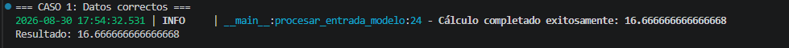
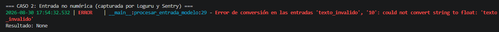
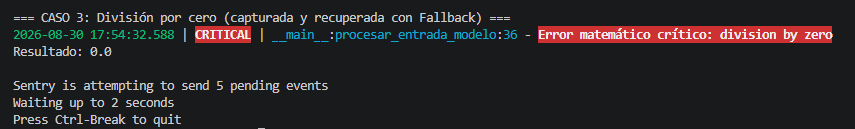
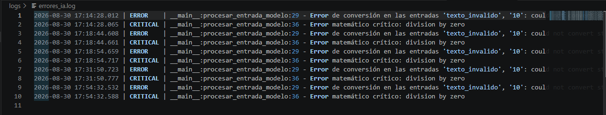

# Reporte Práctico: Implementación y Análisis de Resiliencia con Sentry y Loguru

**Materia:** Sistemas Tolerantes a Fallos  
**Alumno:** Yoav Alejandro Partida Gómez  
**Parcial:** 1  

---

## 1. Código Fuente del Experimento

El script implementa una función de inferencia matemática que procesa entradas, registra el estado de ejecución con **Loguru** y notifica fallos críticos a **Sentry** sin tirar el sistema.

```python
import sentry_sdk
from loguru import logger
import sys

# 1. Configurar Loguru para registrar errores en un archivo local persistente
logger.remove()
logger.add(sys.stderr, level="INFO")
logger.add("logs/errores_ia.log", rotation="500 KB", level="ERROR", backtrace=True, diagnose=True)

# 2. Inicializar Sentry SDK
sentry_sdk.init(
    dsn="[https://1234567890abcdef1234567890abcdef@o123456.ingest.sentry.io/123456](https://1234567890abcdef1234567890abcdef@o123456.ingest.sentry.io/123456)",
    traces_sample_rate=1.0,
)

def procesar_entrada_modelo(valor_a: str, valor_b: str) -> float:
    """Intenta procesar y calcular la inferencia a partir de strings de entrada."""
    try:
        num_a = float(valor_a)
        num_b = float(valor_b)
        
        # Simulación de cálculo del modelo
        resultado = num_a / num_b
        logger.info(f"Cálculo completado exitosamente: {resultado}")
        return resultado

    except ValueError as val_err:
        # Registro local estructurado con Loguru
        logger.error(f"Error de conversión en las entradas '{valor_a}', '{valor_b}': {val_err}")
        # Notificación a Sentry
        sentry_sdk.capture_exception(val_err)
        return None

    except ZeroDivisionError as zero_err:
        # Captura de error crítico y activación de Fallback
        logger.critical(f"Error matemático crítico: {zero_err}")
        sentry_sdk.capture_exception(zero_err)
        return 0.0  # Fallback de recuperación


# --- Pruebas del sistema ---
if __name__ == "__main__":
    print("=== CASO 1: Datos correctos ===")
    res1 = procesar_entrada_modelo("50.0", "3.0")
    print(f"Resultado: {res1}\n")

    print("=== CASO 2: Entrada no numérica (capturada por Loguru y Sentry) ===")
    res2 = procesar_entrada_modelo("texto_invalido", "10")
    print(f"Resultado: {res2}\n")

    print("=== CASO 3: División por cero (capturada y recuperada con Fallback) ===")
    res3 = procesar_entrada_modelo("100", "0")
    print(f"Resultado: {res3}\n")
```

---

## 2. Destripando el Código: Funcionamiento Interno

**A. Loguru (Gestor de Logs y Archivo de Errores)**
* `logger.add(sys.stderr, level="INFO")`: Muestra mensajes en consola con formato de colores, fecha y hora.
* `logger.add("logs/errores_ia.log", rotation="500 KB", level="ERROR")`: Crea automáticamente la carpeta `logs/` y guarda exclusivamente los eventos de nivel `ERROR` y `CRITICAL`. La rotación a `500 KB` evita que el archivo crezca indefinidamente.

**B. Sentry SDK (Rastreador en la Nube)**
* `sentry_sdk.capture_exception(...)`: Intercepta la excepción y la empaqueta junto con el contexto del sistema para enviarla al servidor de observabilidad en la nube.

**C. Mecanismo de Fallback (Tolerancia a Fallos)**
* Si se produce una indeterminación matemática (`ZeroDivisionError`), el programa no colapsa con un *crash*, sino que retorna un valor de contingencia neutro (`0.0`), manteniendo la disponibilidad del servicio.

---

## 3. Análisis de Resultados con Evidencias de Ejecución

### Caso 1: Flujo Normal (Camino Feliz)
* **Entrada:** `"50.0"` y `"3.0"`
* **Comportamiento:** La conversión a punto flotante es exitosa y se realiza la operación. Loguru imprime un evento `INFO` verde indicando éxito y el sistema entrega el resultado numérico (`16.666666666666668`).



---

### Caso 2: Manejo de Entradas No Numéricas
* **Entrada:** `"texto_invalido"` y `"10"`
* **Comportamiento:** `float("texto_invalido")` levanta un `ValueError`. El bloque `except` captura el problema, Loguru genera una traza `ERROR` roja en consola/archivo y Sentry recibe el reporte. El sistema devuelve `None` de forma controlada sin romperse.



---

### Caso 3: Recuperación por Fallback y Despacho a Sentry
* **Entrada:** `"100"` y `"0"`
* **Comportamiento:** Al dividir por cero se genera `ZeroDivisionError`. Loguru registra una alerta `CRITICAL` y se activa el mecanismo de retorno por defecto (`0.0`). Inmediatamente, el SDK de Sentry inicia el envío de los eventos pendientes hacia la nube.



---

## 4. Auditoría y Persistencia de Logs

Loguru creó automáticamente la ruta `logs/errores_ia.log`, registrando un historial inmutable y cronológico de todas las anomalías producidas durante las ejecuciones:



Cada línea del archivo contiene la estampa de tiempo exacta, el nivel de severidad, el módulo y la línea de código causante del fallo, lo que facilita el diagnóstico y la depuración sin interrumpir la operación del sistema.