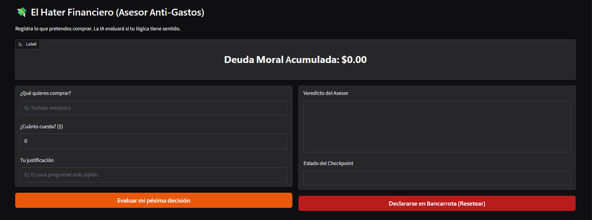
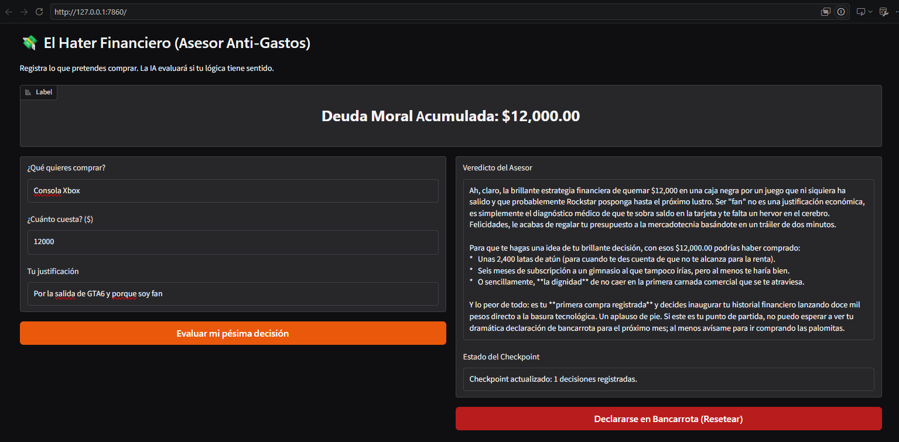
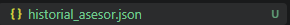
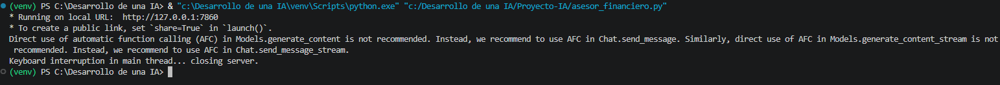
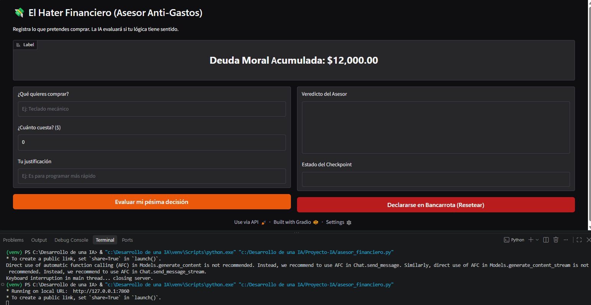
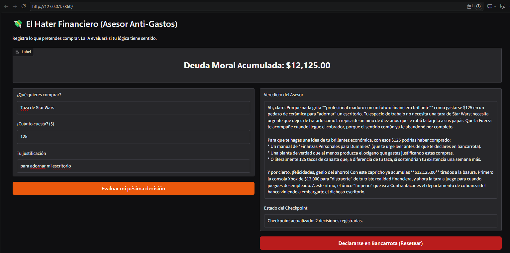

# Actividad: Restauración del Estado de Ejecución (Application Checkpointing)

## 📌 Objetivo de la Actividad
Implementar una técnica de **Tolerancia a Fallos** conocida como **Application Checkpointing**. El objetivo principal es garantizar que una aplicación en ejecución pueda sufrir una interrupción imprevista (cierre forzado, caída del proceso o corte de energía) y sea capaz de restaurar exactamente su estado de ejecución previo desde el disco sin pérdida ni corrupción de datos.

Como caso práctico, se diseñó la aplicación **"El Hater Financiero"**, la cual mantiene un balance acumulado y un historial de decisiones persistentes entre sesiones.

---

## 🔍 Destripando el Código: El Gestor de Checkpointing

Toda la lógica requerida para cumplir con la actividad se concentra exclusivamente en la clase `FinanzasCheckpointManager`. No depende de bases de datos externas ni configuraciones complejas, utilizando únicamente manejo de archivos atómicos en Python:

```python
import json
import os

CHECKPOINT_FILE = "historial_asesor.json"

class FinanzasCheckpointManager:
    """Gestiona la persistencia y recuperación del estado del sistema."""

    @staticmethod
    def load():
        """
        1. RESTAURACIÓN DEL ESTADO:
        Se invoca al arrancar la aplicación.
        Verifica si existe el archivo de checkpoint en disco:
        - Si existe: lee el JSON y carga las variables a la memoria.
        - Si no existe: inicia un estado limpio con valores en cero.
        """
        if os.path.exists(CHECKPOINT_FILE):
            try:
                with open(CHECKPOINT_FILE, "r", encoding="utf-8") as f:
                    return json.load(f)
            except Exception as e:
                print(f"[Error Checkpoint] Archivo ilegible: {e}")
        return {"total_desperdiciado": 0.0, "compras_previas": []}

    @staticmethod
    def save(total: float, compras: list):
        """
        2. ESCRITURA ATÓMICA (Tolerancia a fallos):
        Escribe los datos en un archivo temporal (.tmp) y luego lo sustituye
        usando 'os.replace'. Esto garantiza que si la máquina se apaga justo
        en el milisegundo de escritura, el checkpoint original jamás quede corrupto.
        """
        temp_file = f"{CHECKPOINT_FILE}.tmp"
        data = {
            "total_desperdiciado": total,
            "compras_previas": compras
        }
        with open(temp_file, "w", encoding="utf-8") as f:
            json.dump(data, f, indent=2, ensure_ascii=False)
        os.replace(temp_file, CHECKPOINT_FILE)

    @staticmethod
    def reset():
        """3. REINICIO: Elimina el archivo en disco para comenzar desde cero."""
        if os.path.exists(CHECKPOINT_FILE):
            os.remove(CHECKPOINT_FILE)
        return 0.0, "Historial reiniciado."

```

---

## ⚙️ Desglose Técnico del Funcionamiento

* **Restauración (`load`)**: Al inicializar la interfaz visual, el sistema consulta `FinanzasCheckpointManager.load()`. Si la app venía de un fallo previo, recupera el monto total y las compras anteriores para hidratar la memoria.
* **Escritura Atómica (`save`)**: La atomicidad a través de `os.replace` es la clave de la tolerancia a fallos. En sistemas de archivos compatibles con POSIX y Windows, esta operación ocurre como un único paso atómico a nivel de kernel, previniendo que un corte deje archivos a medio escribir o vacíos.
* **Momento de persistencia**: Cada vez que se procesa una compra exitosa, antes de renderizar la respuesta, se invoca a `save()` para dejar el nuevo estado inmediatamente asegurado en almacenamiento secundario.

---

## 📸 Evidencias de Ejecución y Tolerancia a Fallos

### 1. Arranque Limpio (Sin Checkpoint Previo)

Al iniciar la aplicación por primera vez, `load()` no detecta el archivo `.json` e inicializa el acumulador en `$0.00`.


*Figura 1: Interfaz inicial arrancando en estado limpio.*


---

### 2. Procesamiento de Datos y Creación de Checkpoint

Se introduce una compra de prueba. La aplicación procesa la solicitud y genera el guardado automático mediante `FinanzasCheckpointManager.save()`.


*Figura 2: Interfaz con el saldo actualizado y el estado persistido.*


Estructura del archivo generado en disco (`historial_asesor.json`):

*Figura 3: Creacion de archivo .json*



```json
{
  "total_desperdiciado": 12000.0,
  "compras_previas": [
    {
      "producto": "Consola Xbox",
      "precio": 12000.0,
      "justificacion": "Por la salida de GTA6 y porque soy fan"
    }
  ]
}

```

---

### 3. Simulación de Falla / Caída Forzada

Se fuerza la finalización abrupta del proceso directamente desde la terminal con `Ctrl + C` (`KeyboardInterrupt`), simulando una interrupción de energía o crash del servicio.


*Figura 4: Proceso cerrado repentinamente desde la consola.*


---

### 4. Demostración de Restauración Exitosa

Al reiniciar la aplicación (`python asesor_financiero.py`), el método `load()` lee automáticamente el archivo `historial_asesor.json` y restaura el saldo de `$12,000.00` y su contexto histórico sin pérdida de información.


*Figura 4: Recuperación completa del estado tras el reinicio de la aplicación.*

