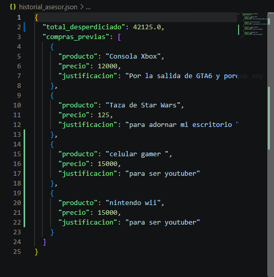

# ⚡ Reporte de Concurrencia y Escalabilidad: Hilos y Asincronía en Python

## 📖 Descripción General
Este proyecto demuestra la implementación práctica de **programación asíncrona (`asyncio`)** y **multihilo (`threading`)** aplicada a un backend de Inteligencia Artificial ("El Hater Financiero") construido con **Gradio** y la API de **Google Gemini**.

El objetivo principal es resolver los dos cuellos de botella de Entradas/Salidas (I/O) más comunes en sistemas distribuidos:
1. **I/O de Red:** Espera de respuesta de servicios externos (APIs).
2. **I/O de Disco:** Persistencia de estado en almacenamiento local (Checkpointing).

---

## 📸 Evidencias de Ejecución (Capturas de Pantalla)

### Captura 1: Interfaz Interactiva y Respuesta Asíncrona


---

### Captura 2: Consola de Comandos y Ejecución Multihilo


---

## 🔍 Análisis Interno del Código (Destripando la Concurrencia)

A diferencia de un enfoque tradicional bloqueante, la arquitectura se divide en dos componentes concurrentes principales:

---

### 1. Invocación Asíncrona de la IA (`asyncio`)

Para evitar que el servidor de Gradio se congele durante los 2 a 3 segundos que toma la llamada de red a los servidores de Google, se implementa el cliente asíncrono (`client.aio`) mediante un bucle de eventos (*Event Loop*).

```python
# Se define la función de inferencia como asíncrona (non-blocking)
async def juzgar_compra(producto: str, precio: float, justificacion: str):
    # ... preparación del prompt ...

    # Petición I/O de red asíncrona a Gemini
    response = await client.aio.models.generate_content(
        model="gemini-2.5-flash", contents=prompt
    )
    veredicto = response.text.strip() 
```
Explicación: La palabra clave `async def` le indica a Python que la función puede pausar su ejecución en puntos específicos. El operador `await` suspende temporalmente **juzgar_compra** durante la llamada a la red, liberando el hilo principal para mantener la interfaz web activa (el usuario puede editar texto o modificar campos sin bloqueos visuales).

---

### 2. Escritura en Disco Delegada a Hilos (threading)

El guardado del archivo JSON en disco duro es una operación I/O síncrona y pesada. Para que la respuesta de la IA se muestre al instante en pantalla sin esperar a que la computadora termine de escribir en el archivo físico, la persistencia se delega a un hilo secundario mediante ThreadPoolExecutor.




# Pool de hilos asignado específicamente para operaciones de almacenamiento

```python
executor_disco = ThreadPoolExecutor(max_workers=2)


class FinanzasCheckpointManager:

    @staticmethod
    def _save_sync(total: float, compras: list):
        """Método síncrono que realiza la escritura atómica en el archivo JSON."""
        print(
            f"[Thread {threading.current_thread().name}] Guardando checkpoint en disco..."
        )
        temp_file = f"{CHECKPOINT_FILE}.tmp"
        data = {"total_desperdiciado": total, "compras_previas": compras}
        with open(temp_file, "w", encoding="utf-8") as f:
            json.dump(data, f, indent=2, ensure_ascii=False)
        os.replace(temp_file, CHECKPOINT_FILE)
        print(f"[Thread {threading.current_thread().name}] Checkpoint guardado.")

    @classmethod
    def save_async_thread(cls, total: float, compras: list):
        """Envía la tarea de guardado al Pool de Hilos sin bloquear el hilo principal."""
        executor_disco.submit(cls._save_sync, total, compras)
```

Explicación: `executor_disco.submit()` toma la función `_save_sync` y la ejecuta en un hilo aislado en segundo plano **(ThreadPoolExecutor-0_0)**. Esto permite que el flujo de la función principal retorne la respuesta a la interfaz de Gradio inmediatamente, mientras el hilo trabajador procesa la escritura del archivo en paralelo.

##  Tabla Comparativa de Rendimiento

| Estrategia | Operación | Implementación | Beneficio Principal |
| :--- | :--- | :--- | :--- |
| **`asyncio`** | Petición I/O de Red (API Gemini) | `async def` + `await client.aio` | Evita que la interfaz web se congele durante la consulta. |
| **`threading`** | Persistencia I/O de Disco (JSON) | `ThreadPoolExecutor.submit()` | Retorna la respuesta visual sin esperar a que finalice la escritura en disco. |
| **Atómica** | Manejo de Archivos | Escritura en `.tmp` + `os.replace` | Previene la corrupción del estado si la aplicación se interrumpe abruptamente. |