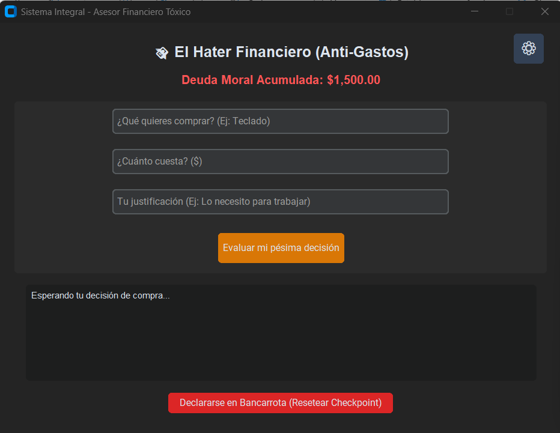
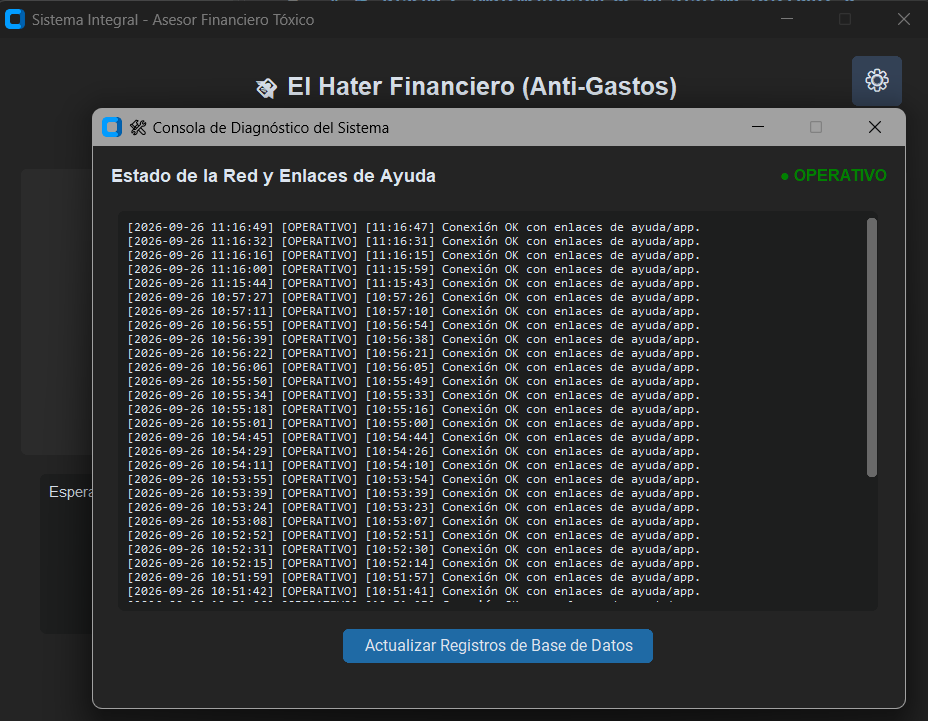
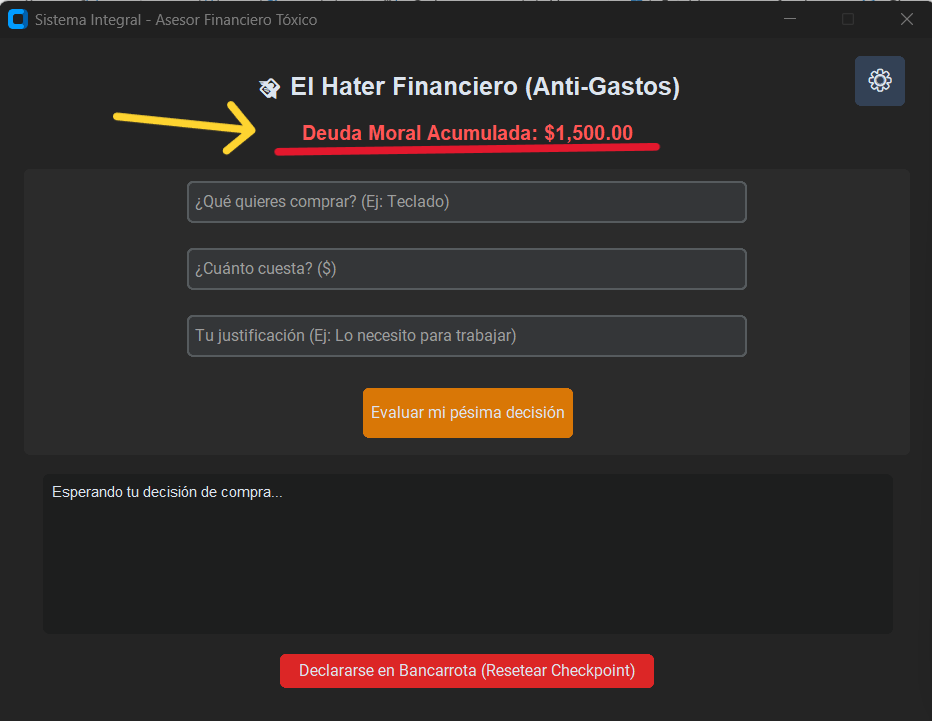
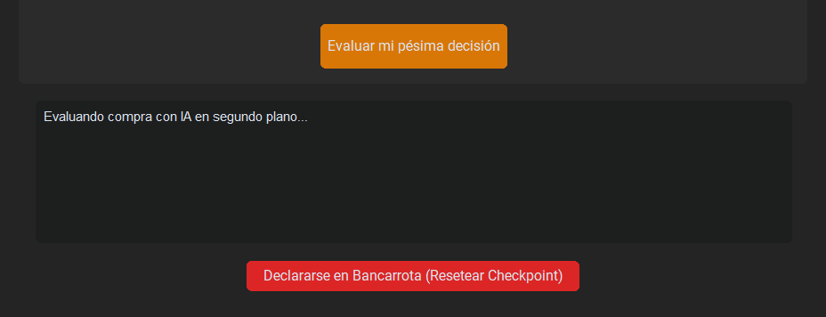
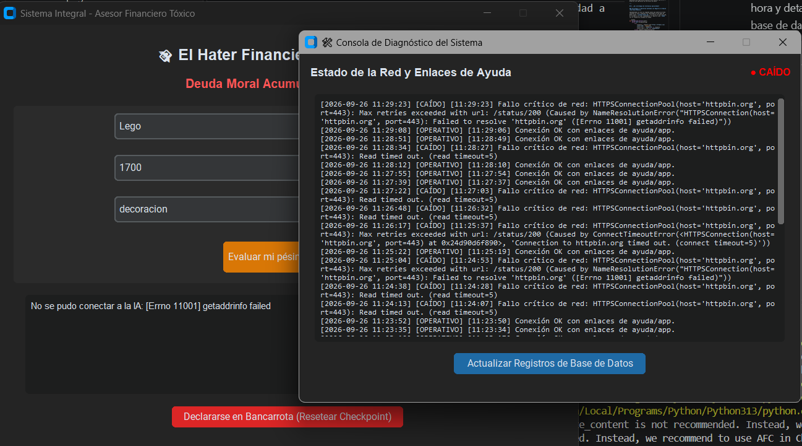
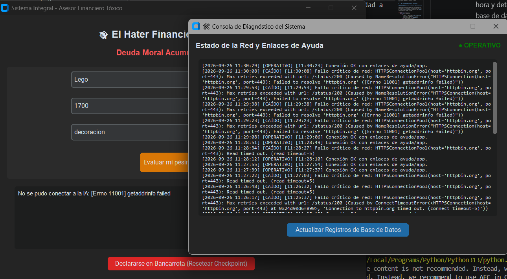

---

# 🛡️ Diseño e Implementación de un Sistema Tolerante a Fallas mediante Demonios (Servicios) para revisar el estado de tu app (Estatus)

## 1. El problema que deseamos resolver

En las aplicaciones de escritorio modernas que interactúan con servicios externos (como APIs de Inteligencia Artificial) o redes locales, los sistemas se enfrentan constantemente a dos grandes problemas:

* **Bloqueos de interfaz:** Las consultas a internet o procesamiento pesado suelen congelar la ventana principal (*Not Responding*), arruinando la experiencia del usuario.
* **Pérdida de información ante fallos:** Si la aplicación se apaga de golpe (por un corte de energía o cierre forzoso), los datos acumulados durante la sesión suelen corromperse o desaparecer por completo.

---

## 2. ¿Por qué requiere ejecución en segundo plano?

Para solucionar los bloqueos, la aplicación delega las tareas pesadas a **hilos secundarios independientes (`threading.Thread`)**. De esta forma:

1. El **hilo principal** se encarga únicamente de mantener la interfaz gráfica fluida y responsiva.
2. Un **hilo secundario (demonio)** opera de forma invisible monitoreando la salud del sistema y registrando eventos sin interrumpir al usuario.

---

## 3. ¿Qué tipo de falla podría ocurrir?

En nuestra arquitectura se contemplan y simulan dos escenarios críticos de fallo:

* **Falla de conectividad o red:** Interrupción temporal en la red o caída del servicio externo auditado.
* **Cierre abrupto (Kill Process):** Cierre forzoso de la aplicación por parte del usuario o del sistema operativo a mitad de una operación de escritura de datos.

---

## 4. ¿Qué estrategia de tolerancia aplicaremos?

### Estrategia A: Monitoreo Autónomo con Registro en SQLite (Heartbeat/Demonio)

Implementamos un hilo en segundo plano que audita de forma continua la red y almacena los resultados en una base de datos local (`system_status.db`). Si ocurre un fallo de red, el sistema no se cae; simplemente lo registra como `CAÍDO` con su respectiva estampa de tiempo.

```python
def background_monitor(self):
    while self.is_monitoring:
        try:
            response = requests.get("https://httpbin.org/status/200", timeout=5)
            status_text = "OPERATIVO" if response.status_code == 200 else "ADVERTENCIA"
        except requests.RequestException:
            status_text = "CAÍDO" # Tolerancia activa ante interrupciones de red
            
        log_event(status_text, "Verificación de enlaces de ayuda")
        time.sleep(15)

```

> **Visualización del Monitoreo:**
> *Mediante un discreto botón de configuración en la esquina superior, el usuario puede desplegar la consola de diagnóstico bajo demanda sin estorbar la pantalla principal.*




---

### Estrategia B: Checkpointing Atómico para Recuperación de Estado

Para evitar la corrupción de datos ante un apagón o cierre forzoso, implementamos un mecanismo de **checkpointing atómico**. Los datos se escriben primero en un archivo temporal seguro (`.tmp`) y después se reemplazan de golpe mediante `os.replace()`.

```python
class FinanzasCheckpointManager:
    @staticmethod
    def _save_sync(total: float, compras: list):
        temp_file = "historial_asesor.json.tmp"
        data = {"total_desperdiciado": total, "compras_previas": compras}
        
        # 1. Se escribe de forma segura en un archivo temporal
        with open(temp_file, "w", encoding="utf-8") as f:
            json.dump(data, f, indent=2, ensure_ascii=False)
            
        # 2. Reemplazo atómico en disco (evita archivos vacíos o corruptos)
        os.replace(temp_file, "historial_asesor.json")

```

> **Demostración de Persistencia:**
> *Al registrar gastos y cerrar la app abruptamente, el sistema recupera de manera automática el monto acumulado al volver a iniciar.*


---

### Estrategia C: Aislamiento de Procesos (Multithreading)

Para garantizar que la aplicación principal mantenga alta disponibilidad, la comunicación con la API de IA se aísla por completo del hilo gráfico:

```python
def ejecutar_juicio_financiero(self):
    # La interfaz avisa sin congelarse y lanza un hilo secundario
    self.actualizar_texto_veredicto("Evaluando compra con IA en segundo plano...")
    threading.Thread(target=self._proceso_ia_hilo, args=(prod, precio, excusa), daemon=True).start()

```




---

### 5. Análisis del Comportamiento en un Caso de Falla de Red

Cuando ocurre una interrupción de red (por ejemplo, al desconectar el cable de internet o perder la señal Wi-Fi mientras el demonio está activo), el sistema evita un cierre crítico (*crash*) aplicando un bloque protegido `try-except` dentro del hilo en segundo plano.

#### Fragmento de código de manejo de excepciones:

```python
def background_monitor(self):
    target_url = "https://httpbin.org/status/200"
    
    while self.is_monitoring:
        timestamp = datetime.now().strftime("%H:%M:%S")
        try:
            # Intentamos la conexión con un tiempo límite de espera
            response = requests.get(target_url, timeout=5)
            if response.status_code == 200:
                status_text, color_ui = "OPERATIVO", "green"
                msg = f"[{timestamp}] Conexión OK con enlaces de ayuda/app."
            else:
                status_text, color_ui = "ADVERTENCIA", "orange"
                msg = f"[{timestamp}] Respuesta con código: {response.status_code}"
                
        except requests.RequestException as e:
            # Capturamos el fallo de red sin detener la aplicación principal
            status_text, color_ui = "CAÍDO", "red"
            msg = f"[{timestamp}] Fallo crítico de red: {e}"

        # Registramos el evento de forma persistente en SQLite
        log_event(status_text, msg)
        
        # Actualizamos la interfaz flotante en tiempo real si está abierta
        if self.monitor_window_ref and self.monitor_window_ref.winfo_exists():
            self.after(0, lambda s=status_text, c=color_ui: self.monitor_window_ref.update_status_label(s, c))
            
        time.sleep(15)

```

#### ¿Cómo se evidencia la tolerancia a fallos en la interfaz?

1. **No hay congelamientos:** La aplicación principal del Asesor Financiero sigue funcionando con total normalidad a pesar de que la red externa haya fallado.
2. **Diagnóstico visual inmediato:** Al abrir la ventana flotante de diagnóstico mediante el botón de engranaje (`⚙️`), el indicador cambia automáticamente a color rojo con la etiqueta **"CAÍDO"**.
3. **Trazabilidad en SQLite:** Todos los intentos fallidos con su respectiva hora y detalle técnico se quedan guardados permanentemente en la base de datos local para su posterior auditoría.


