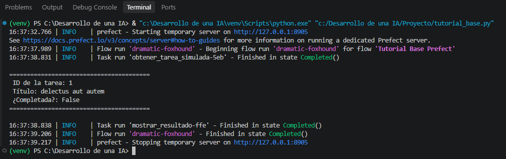
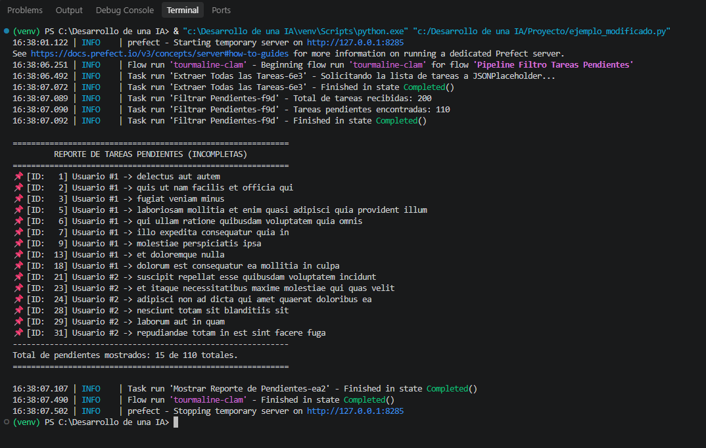

---

# Introducción a PREFECT y Manejo de Flujos de Trabajo

1. ¿Qué es Prefect?

**Prefect** es una herramienta de **orquestación de flujos de trabajo (*workflows*) en Python** diseñada para coordinar, monitorear y automatizar tuberías de datos (*data pipelines*).

### Filosofía: *"Task Failed Successfully"* (Jeremiah Lowin)

En sistemas distribuidos, servicios web e inteligencia artificial, **las fallas de red, caídas de servidores o errores en la transmisión de datos son inevitables**. La filosofía de Prefect propone que el código no debe colapsar (*crash*) ante un error imprevisto.

En lugar de intentar evitar que ocurran fallas, Prefect intercepta los errores en tiempo de ejecución, aplica políticas de reintento automático (*retries*), gestiona estados (*Pending*, *Running*, *Failed*, *Completed*) y registra el historial completo sin romper la ejecución principal del programa.

---

## 2. Parte 1: Tutorial Base (`tutorial_base.py`)

Esta parte implementa los conceptos fundamentales presentados en el tutorial de PyData Denver (adaptados a la sintaxis moderna con decoradores).

### Código Fuente

```python
import requests
from prefect import task, flow

@task(retries=3, retry_delay_seconds=2)
def obtener_tarea_simulada():
    """Pide un elemento de prueba a la API."""
    url = "https://jsonplaceholder.cypress.io/todos/1"
    respuesta = requests.get(url)
    return respuesta.json()

@task
def mostrar_resultado(datos):
    """Muestra en pantalla la información recuperada."""
    print("\n" + "="*40)
    print(f" ID de la tarea: {datos['id']}")
    print(f" Título: {datos['title']}")
    print(f" ¿Completada?: {datos['completed']}")
    print("="*40 + "\n")

@flow(name="Tutorial Base Prefect")
def flujo_principal():
    """Coordina la ejecución ordenada de las tareas."""
    datos = obtener_tarea_simulada()
    mostrar_resultado(datos)

if __name__ == "__main__":
    flujo_principal()

```

### Explicación Paso a Paso del Código

* **`import requests` / `from prefect import task, flow**`:
Se importan las herramientas necesarias: `requests` para realizar peticiones por internet a la API externa, y `task` / `flow` para estructurar la orquestación con Prefect.
* **`@task(retries=3, retry_delay_seconds=2)`**:
Convierte una función común en una **Tarea de Prefect**.
* `retries=3`: Si la conexión a la API falla o responde con un error de red, Prefect reintentará ejecutar la función automáticamente hasta 3 veces antes de declararla como fallida.
* `retry_delay_seconds=2`: Espera un lapso de 2 segundos entre cada reintento para permitir la recuperación de la red.


* **`obtener_tarea_simulada()`**:
Es la primera estación del flujo. Realiza una petición GET al endpoint público `/todos/1` de JSONPlaceholder y retorna la información en formato diccionario de Python.
* **`mostrar_resultado(datos)`**:
Es la segunda estación del flujo. Recibe la información obtenida por la tarea anterior e imprime los campos clave (`id`, `title`, `completed`) con un formato legible.
* **`@flow(name="Tutorial Base Prefect")`**:
Define el **Flujo Principal**. Funciona como el supervisor que coordina el orden secuencial en el que se deben ejecutar las tareas y registra el estado global de la ejecución.

---

### Ejecución



---

## 3. Parte 2: Modificación y Ejemplo Personalizado (`ejemplo_modificado.py`)

Para la segunda parte se exploró la API pública de Cypress (`[https://jsonplaceholder.cypress.io/](https://jsonplaceholder.cypress.io/)`) seleccionando el recurso **/todos**, transformando la lógica para realizar una **extracción masiva y filtrado de tareas pendientes (incompletas)**.

### Código Fuente

```python
import requests
from prefect import task, flow, get_run_logger

@task(retries=3, retry_delay_seconds=2, name="Extraer Todas las Tareas")
def obtener_todos():
    """Descarga la lista completa de tareas desde la API."""
    logger = get_run_logger()
    url = "https://jsonplaceholder.cypress.io/todos"
    
    logger.info("Solicitando la lista de tareas a JSONPlaceholder...")
    respuesta = requests.get(url, timeout=10)
    respuesta.raise_for_status()
    return respuesta.json()

@task(name="Filtrar Pendientes")
def filtrar_tareas_pendientes(lista_tareas):
    """Filtra la lista y conserva únicamente las tareas no completadas (completed == False)."""
    logger = get_run_logger()
    pendientes = [t for t in lista_tareas if not t.get("completed")]
    
    logger.info(f"Total de tareas recibidas: {len(lista_tareas)}")
    logger.info(f"Tareas pendientes encontradas: {len(pendientes)}")
    return pendientes

@task(name="Mostrar Reporte de Pendientes")
def generar_reporte_pendientes(pendientes):
    """Muestra en pantalla un resumen formateado de las tareas pendientes."""
    print("\n" + "="*60)
    print("         REPORTE DE TAREAS PENDIENTES (INCOMPLETAS)         ")
    print("="*60)
    
    muestra = pendientes[:15]
    for tarea in muestra:
        print(f" [ID: {tarea['id']:>3}] Usuario #{tarea['userId']} -> {tarea['title']}")
    
    print("-" * 60)
    print(f"Total de pendientes mostrados: {len(muestra)} de {len(pendientes)} totales.")
    print("="*60 + "\n")

@flow(name="Pipeline Filtro Tareas Pendientes")
def flujo_control_pendientes():
    todas_las_tareas = obtener_todos()
    solo_pendientes = filtrar_tareas_pendientes(todas_las_tareas)
    generar_reporte_pendientes(solo_pendientes)

if __name__ == "__main__":
    flujo_control_pendientes()

```

### Explicación Paso a Paso del Código

* **`get_run_logger()`**:
Obtiene el sistema de registro de eventos (*logging*) interno de Prefect. Reemplaza las impresiones simples para guardar mensajes estructurados con marcas de tiempo dentro del monitor de Prefect.
* **`respuesta.raise_for_status()`**:
Verifica el código HTTP de respuesta. Si el servidor contesta con un error (ej. 404 o 500), se activa automáticamente la política de reintentos (`retries=3`).
* **`filtrar_tareas_pendientes(lista_tareas)`**:
Aplica una regla de negocio sobre el arreglo completo de 200 elementos. Descarta las tareas finalizadas y conserva únicamente aquellas donde `completed` es igual a `False`.
* **`generar_reporte_pendientes(pendientes)`**:
Muestra una vista limpia y formateada con los primeros 15 elementos pendientes junto con las estadísticas totales del filtrado.

---

### Ejecución



---
